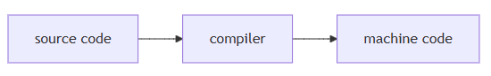
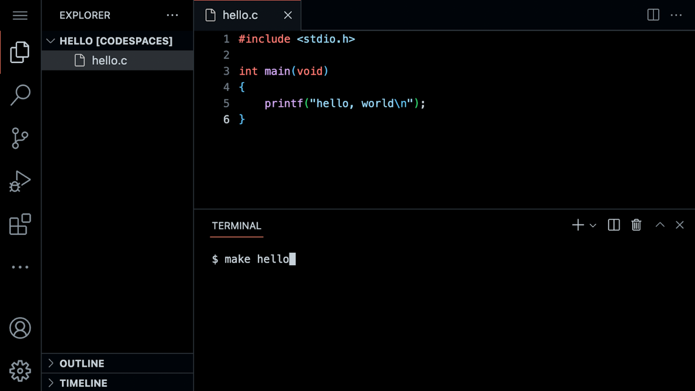

### Welcome!

* In our previous session, we learned about Scratch, a visual programming language.
* Learning computer science concepts can be quite challenging. Indeed, it can feel like you are drinking from a fire hose. Remember: What is ultimately important is the gains you experience over these coming weeks and months through your hard work and study in this course.
* Indeed, all the essential programming concepts presented in Scratch will be utilized as you learn how to program any programming language. Functions, conditionals, loops, and variables found in Scratch are fundamental building blocks that you will find in any programming language.

### Source Code

* Recall that machines only understand binary. Where humans write *source code*, a list of instructions for the computer that is human readable, machines only understand what we can now call *machine code*. This machine code is a pattern of ones and zeros that produces a desired effect.
* It turns out that we can convert *source code* into machine code using a very special piece of software called a *compiler*. Today, we will be introducing you to a compiler that will allow you to convert source code in the programming language C into a machine code.

* Today, in addition to learning how to program, you will be learning how to write good code.

### Visual Studio Code for CS50

* The text editor that is utilized for this course is *Visual Studio Code*, aka *VS Code*, affectionately referred to as [cs50.dev](https://cs50.dev/), which can be accessed via that same URL.
* One of the most important reasons we utilize VS Code is that it has all the software required for the course already pre-loaded on it. This course and the instructions herein were designed with VS Code in mind.
* Manually installing the ncessary software for the course on your own computer is a cumbersome headache. Best always to utilize VS Code for assignments in this course.
* You can open VS code at [cs50.dev](https://cs50.dev/).
* The IDE can be divided into a number of regions:

Notice that there is a *file explorer* on the left side where you can find your files. Further, notice that there is a region in the middle called a *text editor* where you can edit your program. Finally, there is a `command line interface`, known as a *CLi*, *command line*, or *terminal window*, where we can send commands to the computer in the cloud.
* You will also notice in the graphical user interface (GUI) on the left-hand bar, various tools and a file explorer.
* Because this IDE is pre-configured with all the necessary software, you should use it to complete all assignments for this course.

### Hello World

* We will be using three commands to write, compile, and run our first program:
  ```sh
  code hello.c

  make hello

  ./hello
  ```
    The first command, `code hello.c` creates a file and allows us to type instructions for this program. The second command, `make hello`, *compiles* the file from our instructions in C and creates an executable file called `hello`. The last command, `./hello`, runs the program called `hello`.
* We can build your first program in C by typing `code hello.c` into the terminal window. Notice that we deliberately lowercased the entire filename and included the `.c` extension. Then, in the text editor that appears, write code as follows: 
    ```c
    // A program that says hello to the world

    #include <stdio.h>

    int main(void)
    {
        printf("hello, world\n");
    }
    ```
   Note that every single character above serves a purpose. If you type it incorrectly, the program will not run. `printf` is a function that can output a line of text. Notice the placement of the quotes and the semicolon. Further, notice that the `\n` creates a new line after the words `hello, world`.
* Clicking back in the terminal window, you can compile your code by executing `make hello`, Notice that we are omitting `.c`. `make` is a build tool that will compile our `hello.c` file and turn it into a program called `hello`. If executing this command results in no errors, you can proceed. If not, double-check your code to ensure it matches the above.
* Now, type `./hello` and your program will execute saying `hello, world`. 
* Now, open the file explorer on the left. You will notice that there is now both a file called `hello.c` and another file called `hello`. `hello.c` contains your source code that can be read by humans and the compiler. `hello` is an exectuable file containing machine code that the computer can run directly.

### From Scratch to C

* In Scratch, we utilized the `say` block to display any text on the screen. Indeed, in C, we have a function called `printf` that does exactly this.
* Notice our code already invokes this function:

    ```c
    printf("hello world\n");
    ```

   Notice that the printf function is called. The argument passed to printf is `hello, world\n` surrounded by double quotes. The statement of code is closed with a `;`.
* Errors in code are common, especially in regards to syntax like semicolons and quotes. Modify your code as follows:

    ```c
    // \n is missing

    # include <stdio.h>

    int main(void)
    {
        printf("hello, world");
    }
    ```

   Notice the `\n` is now gone.
* In your terminal window, run `make hello`. Because you changed your program, you have to re-compile your program. 
* Typing `./hello` in the terminal window, how did your program change? This `\` character is called an *escape character* that tells the compiler that `\n` is a special instruction to create a line break.
* There are other escape characters you can use:

    ```txt
    \n create a new line
    \r return to the start of a line
    \" print a double quote
    \' print a single quote
    // print a backslash
    ```

* Restore your program to the following:

    ```c
    // A program that says hello to the world

    #include <stdio.h>

    int main(void) 
    {
        printf("hello, world\n");
    }
    ```
    Notice the semicolon and `\n` have been restored.

### Header Files and CS50 Manual Pages

* The statement at the start of the code `#include <stdio.h>` is a very special command that tells the compiler that you want to use the capabilities of a *library* called `stdio.h`, a *header file*. This allows you, among many other things, to utilize the `printf` function. Notice, it's not called `studio`: it's `stdio.h`.
* A *library* is a collection of code created by someone. Libraries are collections of pre-written code and functions that others have written in the past that we can utilize in our code.
* You can read about all the capabilities of this library on the [Manual Pages](https://manual.cs50.io/). The Manual Pages provide a means by which to better understand what various commands do and how they function.
* It turns out that CS50 has its own library called `cs50.h`. There are numerous functions that are included that provide *training wheels* while you get started in C:

    ```c
    get_char
    get_double
    get_float
    get_int
    get_long
    get_string
    ```

* These libraries have been pre-installed for you at [cs50.dev](https://cs50.dev/). If you were attempting to use these libraries on your own computer, you would likely have to install them. This is why you should use [cs50.dev](https://cs50.dev/) in this course, as it has all necessary software installed for you.
* Let's use this library in your program.

### Hello, You

* Recall that in Scratch we had the ability to ask the user, "What's your name?" and say "hello" with that name appended to it. 
* In C, we can do the same. Modify your code as follows:
    ```c
    // get_string and printf with incorrect placeholder

    #include <cs50.h>
    #include <stdio.h>

    int main(void)
    {
    string answer = get_string("What's your name? ");
    printf("hello, answer\n");
    }
    ```
    The `get_string` function is used to get a string from the user. Then, the variable `answer` is passed to the `printf` function.
* Running `make hello` again in the terminal window, notice that numerous errors appear.
* Looking at the errors, `string` and `get_string` are not recognized by the compiler. We need to provide the compiler with these definitions by adding a library called `cs50.h`. Also, we notice that `answer` is not provided as we intended. Modify your code as follows:

    ```c
    // get_string and printf with %s

    #include <cs50.h>
    #include <stdio.h>

    int main(void)
    {
        string answer = get_string("What's your name? ");
        printf("hello, %s\n", answer);
    }
    ```
   The `get_string` function is used to get a string from the user. Then, the variable `answer` is passed to the `printf` function. `%s` tells the `printf` function to prepare itself to receive a `string`.
* Now, running `make hello` again in the terminal window, you can run your program by typing `./hello`. The program now asks for your name and then says hello with your name attached, as intended.
* `answer` is a special holding place we call a *variable*. `answer` is of type `string` and can hold any string within it. There are many *data types*, such as `int`, `bool`, `char`, and many others.
* `%s` is a placeholder called a *format code* that tells the `printf` function to prepare to receive a `string`. `answer` is the `string` being passed to `%s`. 

### Linux

* We have been using the CLI to `make` and run our program.
* The CLI is often more useful than the GUI for executing commands and working with our files.
* In the terminal window, the CLI, some common commands we may use include:
   * `cd`, for changing our current directory (folder)
   * `cp`, for copying files and directories 
   * `ls`, for listing files in a directory
   * `mkdir`, for making a directory
   * `mv`, for moving (renaming) files and directories
   * `rm`, for removing (deleting) files
   * `rmdir`, for removing (deleting) directories
* The most commonly used is `ls` which will list all the files in the current directory. Go ahead and type `ls` into th eterminal window and hit `enter`. You'll see all the files in the current folder.

### Conditionals

* Another building block you utitlized within Scratch was *conditionals*. For example, you might want to do one thing if x is greater than y. Further, you might want to do something else if that condition is not met.
* We look at a few examples from Scratch.
* In C, you can compare two values as follows:
    ```c
    // Conditionals that are mutually exclusive

    if (x < y)
    {
    printf("x is less than y\n");
    }
    else
    {
    printf("x is not less than y\n");
    }
    ```
  Notice how if `x < y`, one outcome occurs. If `x` is not less than `y`, then another outcome occurs.
* Similarly, we can plan for three possible outcomes:
    ```c
    // Conditional that isn't necessary

    if (x < y)
    {
        printf("x is less than y\n");
    }
    else if (x > y)
    {
        printf("x is greater than y\n");
    }
    else if (x == y)
    {
        printf("x is equal to y\n");
    }
    ```
    Notice that not all these lines of code are required. How could we eliminate the unnecessary calculation above?
* You may have guessed that we can improve this code as follows:
    ```c
    // Compare integers

    if (x < y)
    {
        printf("x is less than y\n");
    }
    else if (x > y)
    {
        printf("x is greater than y\n");
    }
    else
    {
        printf("x is equal to y\n");
    }
    ```
    Notice how the final statement is replaced with `else`.

### Types

* There are many data types that are available within C:
    ```txt
    bool
    char
    float
    int
    long
    string
    ...
    ```

### Format Codes

* Earlier, you mar recall that we used a placeholder `%s` for a string in `printf`. This placeholder is called a *format code*. 
* `printf` allows for many format codes. Here is a non-comprehensive list of ones you may utilize in this course:
    ```txt
    %c
    %f
    %i
    %li
    %s
    ```
    `%c` is used for `char` (character) variables. `%f` is used for `float` (floating-point) variables. `%i` is used for `int` or integer variables. `%li` is used for `long` integer variables. `%s` is used for `string` variables. You can find out more about this on the [Manual Pages](https://manual.cs50.io/).
* We will be using many of C's available data types throughout this course.

### Variables

* In C, you can assign a value to an `int` or integer as follows:
    ```c
    int counter = 0;
    ```
    Notice how a variable called `coutner` of type `int` is assigned the value `0`.
* C can also be programmed to add one to `counter` as follows:
    ```c
    counter = counter + 1;
    ```
    Notice how `1` is added to the value of `counter`.
* This can be also represented as:
    ```c
    counter += 1;
    ```
* This can be further simplified to:
    ```c
    counter++;
    ```
    Notice how the `++` is used to add 1.
* You can also subtract one from `counter` as follows:
    ```c
    counter--;
    ```
    Notice how, in this syntax, `1` is removed from the value of `counter`.

### compare.c

* Using this new knowledge about how to assign values to variables, you can program your first conditional statement.
* In the terminal window, type `code compare.c` and write code as follows:
    ```c
    // Conditional, Boolean expression, relational operator

    #include <cs50.h>
    #include <stdio.h>
    
    int main(void)
    {
        // Prompt user for integers
        int x = get_int("What's x? ");
        int y = get_int("What's y? ");

        // Compare integers
        if (x < y)
        {
            printf("x is less than y\n");
        }
    }
    ```
    Notice that we create two variables, an `int` or integer called `x` and another called `y`. The values of these are populated using the `get_int` function.
* You can run your code by executing `make compare` in the terminal window, followed by `./compare`. If you get any error messages, check your code for errors.
* We can improve your program by coding as follows:
    ```c
    // Conditional, Boolean expression, relational operator

    #include <cs50.h>
    #include <stdio.h>

    int main(void)
    {
        // Prompt user for integers
        int x = get_int("What's x? ");
        int y = get_int("What's y? ");

        // Compare integers
        if (x < y)
        {
            printf("x is less than y\n");
        }
        else if (x > y)
        {
            printf("x is greater than y\n");
        }
        else
        {
            printf("x is equal to y\n");
        }
    }
    ```
    Notice that all potential outcomes are now accounted for.
* You can re-make and re-run your program and test it out.
* Examining these programs in various flow charts, you can see the efficiency of our code design decisions. Nearly any block of code can be translated to visual form.

### agree.c

* 